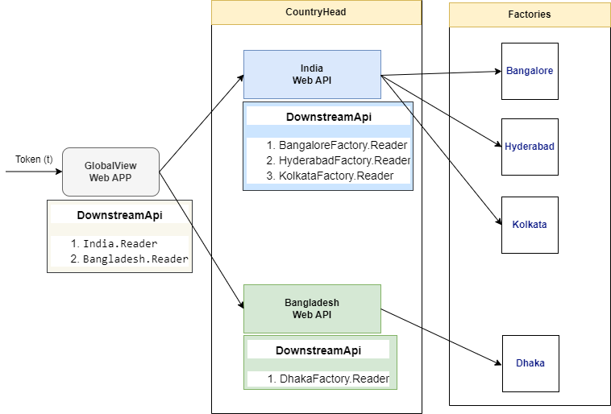

># STS: 'Service-to-Service' Calls on behalf of user.
>It also knows as WebAPI That calls another Web API on behalf of user.

Your app needs to acquire a token for the downstram Web API(called A). That  Web API(A) again needs to calls another downstram Web API(called B).





Adding Cache into CountryHead-India webAPI.


## Prerequisites
Add a package reference for the distributed cache provider

- For a Redis distributed cache, **Microsoft.Extensions.Caching.StackExchangeRedis** and **StackExchange.Redis**
```
  dotnet add package Microsoft.Extensions.Caching.StackExchangeRedis
  dotnet add package StackExchange.Redis
```
## IDistributedCache interface
The IDistributedCache interface provides the following methods to manipulate items in the distributed cache implementation:

 - Get, GetAsync: Accepts a string key and retrieves a cached item as a byte[] array if found in the cache.
 - Set, SetAsync: Adds an item (as byte[] array) to the cache using a string key.
 - Refresh, RefreshAsync: Refreshes an item in the cache based on its key, resetting its sliding expiration timeout (if any).
- Remove, RemoveAsync: Removes a cache item based on its string key.


## Establish distributed caching services
Register an implementation of IDistributedCache in Program.cs. Framework-provided implementations described in this topic include:

 - Distributed Redis cache: Redis cache provides higher throughput and lower latency 
  
An app configures the cache implementation using a RedisCache instance, by calling AddStackExchangeRedisCache. For output caching, use AddStackExchangeRedisOutputCache.

```
services.AddStackExchangeRedisCache(options =>
 {
     options.Configuration = _configuration.GetConnectionString("MyRedisConStr");
     options.InstanceName = "SampleInstance";
 });
 ```

## Distributed Memory Cache
The Distributed Memory Cache (**AddDistributedMemoryCache**) is a framework-provided implementation of IDistributedCache that stores items in memory. The Distributed Memory Cache isn't an actual distributed cache. Cached items are stored by the app instance on the server where the app is running.

The Distributed Memory Cache is a useful implementation:

 - In development and testing scenarios.
 - When a single server is used in production and memory consumption isn't an issue. Implementing the Distributed Memory Cache abstracts cached data storage. It allows for implementing a true distributed caching solution in the future if multiple nodes or fault tolerance become necessary.


The sample app makes use of the Distributed Memory Cache when the app is run in the Development environment in Program.cs:

```
services.AddDistributedMemoryCache();
```

## Use the distributed cache
To use the IDistributedCache interface, request an instance of IDistributedCache in the app. The instance is provided by dependency injection (DI).

When the sample app starts, IDistributedCache is injected into Program.cs. The current time is cached using IHostApplicationLifetime (for more information, see Generic Host: IHostApplicationLifetime):


